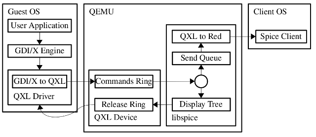
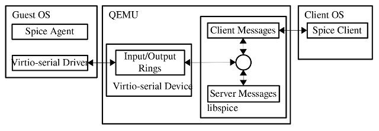

- https://www.spice-space.org/spice-for-newbies.html

## 基本架构

### 图形命令流

上图展示了在将 libspice 与 QEMU 结合使用时，基本的 spice 架构以及图形命令的 guest-to-client 数据流。libspice 也可以被任何其他 VDI 兼容的主机应用程序使用。

图形命令流开始于 &#9312; 一个用户程序请求操作系统图像引擎（X 或 GDI）去执行一个渲染操作。&#9313; 图像引擎传递命令到 QXL 驱动，同时把操作系统命令转换成 QXL 命令，并将命令推送到一个命令环中（commands ring）。命令环是驻留在 QXL 设备内存中的。&#9314; libspice 从命令环中拉取这些命令并把他们加入到图形命令树。图形命令树包含一组命令，其执行将再现显示内容。这个树被 libspice 用来优化到客户端的命令传输（通过丢弃被其它命令隐藏的命令）。这个命令树也被用于视频流的检测。&#9315; libspice 还维护了一个将被送往客户端的命令队列，以更新其显示。 &#9316;当一个命令被从队列中拉取下来以传送给客户端时，它会被转换成为 spice 协议信息。从树中删除的命令也将从发送队列中删除。&#9317; 当一个命令不再被 libspice 需要时，它会被推送到设备释放环（release ring）。&#9318; QXL 驱动使用释放环释放命令资源。&#9319; 当一个客户端收到一个图形命令时它使用该命令更新显示。

### 代理命令流

spice agent 是一个在客户机内部被执行的软件模块。Spice server 和 client 为那些需要在客户机环境中执行的任务（例如配置 guest 的显示设置）使用 agent 。上图展示了 spice client 和 spice server 使用 VDIPort 设备和 guest 驱动与代理进行通信的流程。

消息可以由 client（例如，配置 guest 的显示设置）、server（例如，鼠标移动）及 agent（例如，配置确认） 三者生成。驱动与设备之间的通信使用的是输入输出环。client 和 server 生成的消息被写入到 server 中的同一个写队列，然后稍后被写入到设备输出环。消息被从设备输入环读取到 server 的读取缓存中（read buffer）。消息端口决定了消息应该被 server 处理还是转发给 client。