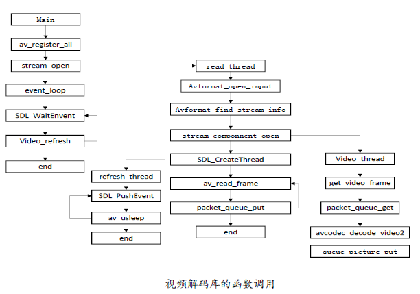

# 目录

    

# 算法
Quic、GLZ/LZ为无损压缩图片算法，属于SPICE专有算法；JPEG是有损压缩算法。

MJPEG（Motion JPEG）视频压缩算法，以25帧/秒的速度使用JPEG算法压缩视频，是spice采用的算法。

播放视频时，服务端解压视频，解压后通过Guest OS的设备驱动传递给主机，主机使用MJPEG传送给客户端。

      
    视频处理流程

# 重定向架构

      

## 控制流和视频数据流
在视频的传送播放过程中主要产生两个数据流：

* 第一个是视频信息控制流：主要是由 FFMPEG HOOK 模块截获视频播放的相关数据，通过 SPICE 命令通道传给 Client OS 端，最终给 FFMPEG Player 模块。
* 第二个是视频文件的传送：在 FFMPEG HOOK 得到播放的文件数据后，视频的控制信息会传送给 Client0S , FFMPEG Player 模块会通过 FILE SHARE 模块请求文件数据。

控制信息传送依赖spice的传送方式virtio-serial（也叫isa-serial）；qemu提供了串口设备的模拟及数据交换通道。表现形式是windows中的串口设备和linux socket文件；串口设备存在于Guest OS中，linux socket存在于Host OS中。

      
    spice控制信息传递

## 视频传输命令控制定义与实现

    

    

    

## FFMPEG解码库和视频传输
### 关闭spice视频压缩方式
在视频重定向的模式下，spice协议的启动参数分别设定如下：
    mage-compression = auto_glz 
    jpeg-wan-compression = never 
    zlib-glz-wan-compression = never 
    streaming-video = off

### 在GUEST OS端FFMPEG解码库的重定义

    

Guest OS 中修改了 FFMPEG 的解码库,在解码库中相关函数中截获了相关视频文件数据以及播放过程中的参数。

### 读取视频文件

    

### 视频解码模块

    

