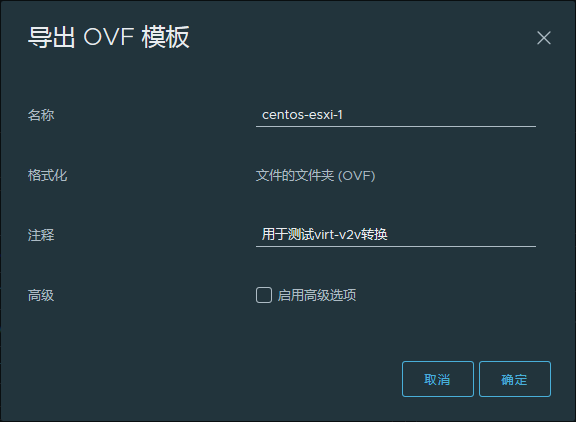
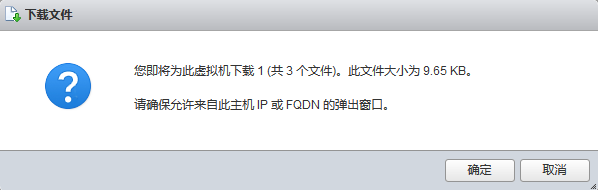
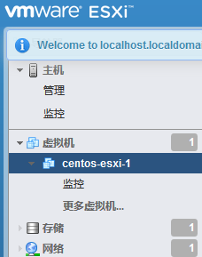

**目录**

[TOC]

利用VMware平台的虚拟机ova文件进行虚拟机转换。

# 1. 获取ova

转换之前首先需要提供ova文件。
ova文件可通过三种方式获取：

- 在服务器的管理界面导出
- 通过命令导出
- 在VMware Workstation的管理界面导出

## 1.1 在服务器的管理界面导出

在`vCenter服务器`和`ESXi服务器`都能通过管理界面导出虚拟机的ova文件。

### 1.1.1 在vCenter界面导出

登录进入vCenter管理界面，点击`导出OVF模板`（选中某个**关机的**虚拟机->鼠标右键->模板->导出OVF模板），即可看到如下界面：



点击`确定`按钮之后会下载一些文件，需要将它们保存在同一个文件夹下（比如`centos-esxi-1`）。

然后将文件夹放入`转换服务器`中打包即可得到ova文件：

```shell
cd centos-esxi-1
tar -cvf centos-esxi-1.ova .
```

### 1.1.2 在ESXi界面导出

登录进入vCenter管理界面，点击`导出`（选中某个**关机的**虚拟机->鼠标右键->导出），即可看到如下界面：



点击`确定`按钮之后会下载一些文件，需要将它们保存在同一个文件夹下（比如`centos-esxi-1-2`）。

然后将文件夹放入`转换服务器`中打包成ova文件：

```shell
cd centos-esxi-1-2
tar -cvf centos-esxi-1-2.ova .
```

## 1.2 通过命令导出

### 1.2.1 安装ovftool

首先获取导出工具`ovftool`，有两种方式：

- 从VMware官网下载linux64位版本的ovftool。[ovftool下载地址](https://www.vmware.com/support/developer/ovf/)
- 从`resources`文件夹下取出`VMware-ovftool-4.3.0-7948156-lin.x86_64.bundle`

将该工具放入`转换服务器`中安装：

```shell
chmod +x VMware-ovftool-4.3.0-7948156-lin.x86_64.bundle
./VMware-ovftool-4.3.0-7948156-lin.x86_64.bundle
```

安装过程中会让你阅读协议（左下角出现`More`字样），不想看的话按`q`退出，输入`yes`同意安装。

### 1.2.2 通过ovftool导出虚拟机ova文件

#### 1.2.2.1 导出ESXi服务器上面的虚拟机

导出ESXi主机上面的虚拟机使用下面格式的命令：

```shell
 ovftool --noSSLVerify \
   vi://USER:PASSWORD@esxi.example.com/VM \
   VM.ova
```

下面是各参数的含义：

- `USER`：登录到ESXi服务器的用户名。
- `PASSWORD`：登录到ESXi服务器的密码。
- `esxi.example.com`：ESXi服务器的域名或IP地址。
- `VM`：ESXi服务器上面的虚拟机的相对路径。
- `VM.ova`：导出的ova文件名。

#### 举例说明：

有一台`centos-esxi-1`的虚拟机在ESXi服务器的路径如下图所示：



那么其导出ova命令为：

```
ovftool --noSSLVerify \
	vi://root:ABC.123456@172.16.2.179/centos-esxi-1 \
	centos-esxi-1-ovftool.ova
```

**注意**：如果链接中存在特殊符号则需要替换为ASCII 十六进制码。比如`vi://root:ABC.123456@172.16.2.179/centos esxi 1`应写为`vi://root:ABC.123456@172.16.2.179/centos%20esxi%201`（空格的ASCII 十六进制码是20）。

#### 1.2.2.2 导出vCenter服务器上面的虚拟机

导出vCenter主机上面的虚拟机使用下面格式的命令：

```shell
 ovftool --noSSLVerify \
   vi://USER:PASSWORD@vcenter.example.com/DATACENTER-NAME/vm/VM \
   VM.ova
```

下面是各参数的含义：

- `USER`：登录到vCenter服务器的用户名。需要时可添加域：`USER@DOMAIN`。
- `PASSWORD`：登录到vCenter服务器的密码。
- `vcenter.example.com`：vCenter服务器的域名或IP地址。
- `DATACENTER-NAME`：虚拟机所在的数据中心名字。
- `vm`：固定参数。表示获取虚拟机。
- `VM`：vCenter服务器上面的虚拟机的相对路径。
- `VM.ova`：导出的ova文件名。

#### 举例说明：

有一台`centos-esxi-1`的虚拟机在vCenter服务器的路径如下图所示：


那么其导出ova命令为：

```shell
ovftool --noSSLVerify \ 
	vi://administrator@vsphere.local:ABCDabcd.1234@172.16.2.178/Datacenter-test/vm/vms/centos-esxi-1 \
	centos-esxi-1-ovftool.ova
```

**注意**：如果链接中存在特殊符号则需要替换为ASCII 十六进制码。比如`vi://administrator@vsphere.local:ABCDabcd.1234@172.16.2.178/Datacenter-test/vm/discovered vms/centos-esxi-1`应写为`vi://administrator@vsphere.local:ABCDabcd.1234@172.16.2.178/Datacenter-test/vm/discovered%20vms/centos-esxi-1`（空格的ASCII 十六进制码是20）。

## 1.3 在VMware Workstation的管理界面导出

在`VMware Workstation`界面选中一台**关机的**虚拟机，依次点击左上角的选项：`文件->导出为OVF`。

此时会弹出一个界面，让你选择导出文件的存储路径。选择好存储路径之后，修改文件后缀名`.ovf`为`.ova`，否则导出的是ovf文件夹。点击保存之后等待导出完成，再将ova文件拷贝或挂载到`转换服务器`中。

# 2. 构造输入选项

通过上述的方式获取到ova文件之后，就可以构造输入选项了。

使用ova转换虚拟机时，转换脚本的支持的输入选项有下列几个：

- `--mode`：输入模式。此处应选 ova。
- `--file`：转换的ova文件。

#### 举例说明

现在Windows上面共享了一个文件夹`ovas`，里面有虚拟机的ova文件，想要通过ova模式对其中的centos.ova文件进行转换。

直接将ova文件放到转换服务器上的`ovas/`目录下；

或者通过挂载的方式将其挂载到转换服务器，在转换服务器上面执行：

```shell
yum install cifs-utils
mount.cifs //172.16.2.27/ovas ovas/ -o user=xxx,pass=xxx,sec=ntlm
```

其中`172.16.2.27`是Windows的IP地址；`ovas`是虚拟机的共享文件夹的名称；`ovas/`是转换服务器上面的一个文件夹；`user=xxx`、`pass=xxx`分别填入Windows登录的用户名和密码。


那么输入选项的构造如下：

```shell
--mode ova --file ovas/centos.ova
```

# 3. 转换到ovirt平台

有了ova作为输入之后，就可以转换到ovirt平台了。

参考：[转换到ovirt平台](转换到ovirt平台.md)