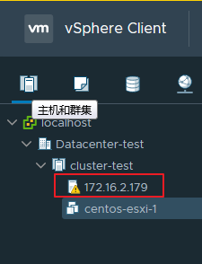

**目录**

[TOC]

通过访问VMware vCenter服务器进行虚拟机转换。

要求vCenter版本>=5.0。

**如果vCenter配置了防火墙，那么你需要打开防火墙端口 443(https) 和 5480。**

# 1. 构造URI

在转换时需要一个URI链接来访问vCenter服务器。

一般的URI格式如下：

```shell
vpx://user@vcenter.example.com/Datacenter/esxi?no_verify=1
```

- `vpx`：固定参数，表示这是一个vCenter类型的链接
- `user`：登录到vCenter服务器的用户名
- `vcenter.example.com`：ESXi服务器的IP地址或域名
- `Datacenter`：vCenter服务器上面的数据中心
- `esxi`：vCenter上的ESXi服务器路径
- `?no_verify=1`：用于取消TLS证书检查。

如果使用文件夹部署VMware，可能需要将其添加到URI，例如：

```shell
 vpx://user@server/Folder/Datacenter/esxi?no_verify=1
```

**注意**：如果URI链接中存在特殊符号则需要替换为ASCII 十六进制码。比如`vpx://administrator@vsphere.local@vcenter.example.com/Datacenter/esxi`应写为`vpx://administrator%40vsphere.local@vcenter.example.com/Datacenter/esxi`（@的ASCII 十六进制码是40）。

# 2. 测试libvirt到vCenter的连接

在转换之前，首先确保该URI是有效的，使用`virsh`命令测试：

```shell
$ virsh -c 'vpx://root@vcenter.example.com/Datacenter/esxi?no_verify=1' list --all
 Enter root's password for vcenter.example.com: ***
 
  Id    Name                           State
 ----------------------------------------------------
  -     Fedora 20                      shut off
  -     Windows 2003                   shut off
```

如果能看到虚拟机列表，则进一步测试：

```shell
 $ virsh -c 'vpx://root@vcenter.example.com/Datacenter/esxi?no_verify=1' dumpxml "Windows 2003"
 <domain type='vmware'>
   <name>Windows 2003</name>
   [...]
 </domain>
```

如果成功输出配置文件信息，那么表示该URI可用。

**`警告`**：如果测试失败，那么虚拟机转换不会成功！

# 3. 构造输入选项

在vCenter模式的转换方式下，转换脚本的输入选项有以下几个：

- `--mode`：转换模式。此处为vCenter。
- `--uri`：连接到vCenter服务器的远程链接。
- `--vm-name`：要转换的虚拟机名字。此虚拟机必须在测试URI连接结果的虚拟机列表中。
- `--password-file`：存放登录到vCenter服务器密码的文件。文件中的密码必须是完整的密码且不能跟随任何换行符。可选选项，如果不指定在转换时需要手动输入密码。

#### 举例说明：

现在有一台vCenter服务器，IP地址为`172.16.2.178`，vCenter的登录用户名及域为`administrator@vsphere.local`，密码存放在`vcenter.pass`文件中；一台ESXi服务器，其IP地址为`172.16.2.179`，上面有一台虚拟机`centos-esxi-1`；vCenter上的ESXi服务器所在路径如下图所示：



那么其URI：

```shell
vpx://administrator%40vsphere.local@172.16.2.178/Datacenter-test/cluster-test/172.16.2.179?no_verify=1
```

注意：该链接中的连接用户名和域名的`@`符号被替换为ASCII 十六进制码`%40`。

然后在转换服务器上进行连接测试：

```shell
$ virsh -c 'vpx://administrator%40vsphere.local@172.16.2.178/Datacenter-test/cluster-test/172.16.2.179?no_verify=1' list --all
Enter administrator@vsphere.local's password for 172.16.2.178:
 Id    Name                           State
----------------------------------------------------
 -     centos-esxi-1                  shut off
```

进一步的测试：

```shell
$ virsh -c 'vpx://administrator%40vsphere.local@172.16.2.178/Datacenter-test/cluster-test/172.16.2.179?no_verify=1' dumpxml "centos-esxi-1"
Enter administrator@vsphere.local's password for 172.16.2.178:
<domain type='vmware' xmlns:vmware='http://libvirt.org/schemas/domain/vmware/1.0'>
  <name>centos-esxi-1</name>
   [...]
 </domain>
```

测试成功，输入选项构造如下：

```shell
--mode vCenter --uri vpx://administrator%40vsphere.local@172.16.2.178/Datacenter-test/cluster-test/172.16.2.179?no_verify=1 --vm-name centos-esxi-1 --password-file vcenter.pass
```

# 4. 转换到ovirt平台

参考：[转换到ovirt平台](转换到ovirt平台.md)

