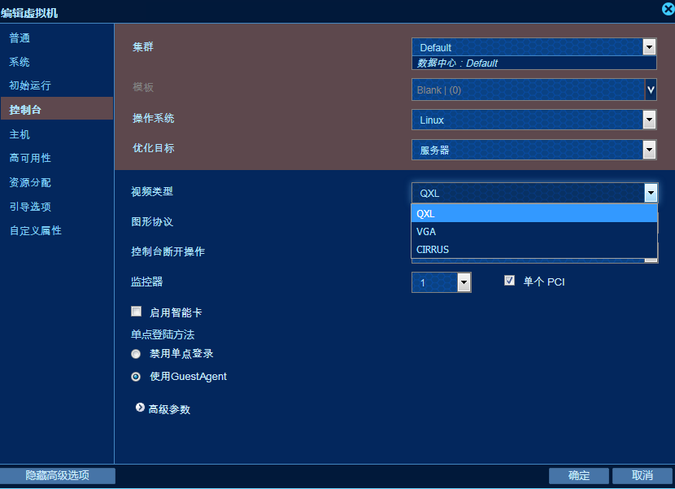

# 1. 构造输出选项

不管任何输入选项是什么，转换到`ovirt`平台的转换脚本的输出选项都是统一的。

选项列表如下：

- `--export-path`：ovirt平台的**导出域**的路径。
- `--format`：转换之后磁盘的格式，支持`raw`与`qcow2`两种格式。可选选项，默认为`raw`。
- `--verbose`：详细输出模式。默认不开启。
- `--log`：使用日志文件记录转换脚本的控制台输出。默认无。

*举例说明：*

现在有一个NFS类型的**导出域**在`172.16.2.124`的服务器上面，导出域的存储目录是`/home/exports`，那么该导出域的路径就是`172.16.2.124:/home/exports`；也可以手动挂载远程服务器的导出域到转换服务器，那么导出域的路径就是`挂载点`。

那么转换脚本的输出选项构造如下：

```shell
--export-path 172.16.2.124:/home/exports --format qcow2 --verbose --log centos-convert.log
```

**`注意`**：如果导出路径指定的是远程服务器的路径，那么导出域的类型一定要是**NFS**，在导出之前应确保导出域能够挂载到转换服务器上面。必须有**充足的空间**存储转换后的虚拟机磁盘。

# 2. 导入虚拟机

转换脚本执行成功之后，虚拟机存放在导出域中，还不能直接使用，需要在ovirt的engine管理平台从导出域导入虚拟机。

导入虚拟机后查看`虚拟机设备`中的`视频`类型：


如果是video等不支持的格式，编辑虚拟机的高级选项改变其类型。



