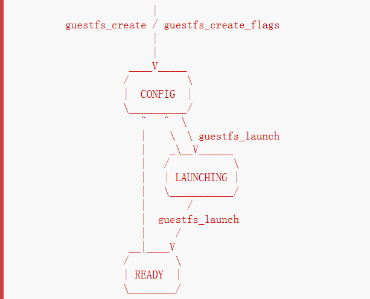

`libguestfs`是访问并修改虚拟机磁盘映像的一系列工具。

它能让几乎任何磁盘映像imaginable。

它是一个C语言库。

下面是其体系结构。

[libguestfs官方网站](http://libguestfs.org/)

[原文地址](http://libguestfs.org/guestfs-internals.1.html)

# 1.架构


libguestfs的实现方式是通过使用`qemu`运行一个`appliance`（一种特殊类型的小虚拟机）。`qemu`作为主程序的一个子进程运行。

链接到主程序的`library`创建子进程，然后在`guestfs_launch`函数中创建appliance。

在`appliance`内部是一个linux内核、一堆完整的用户空间工具（例如LVM、ext2程序）和一个守护进程`guestfsd`（以下使用`daemon`代替）。`library`告诉`daemon`使用远程程序调用（RPC）。**libguestfs API**调用和对守护进程的**RPC**调用之间通常存在一对一的对应关系。最后，`disk image`被附加到qemu进程，该进程将设备的linux内核对设备的访问转换为对映像的访问。

# 2.状态机

libguestfs使用状态机来建模子进程：



正常的状态转换流程：

1. `CONFIG`：处理程序已被创建，但是还没有子进程
2. `LAUNCHING`：子进程正在启动
3. `READY`：此时意味着appliance已经启动，可以发送动作并被子进程执行

`guest`（指虚拟机映像image，可通过`virt-builder`创建）可能会被杀掉（函数 guestfs_kill_subprocess），或在任何时间异步地死掉（一些内部错误），导致状态回到`CONFIG`。

配置命令（例如函数 guestfs_set_path）只能在`CONFIG`状态发出。

`API`提供了从`CONFIG`经过`LAUNCHING`到`READY`的调用：函数`guestfs_launch`会阻塞直到子进程是`READY`状态（或者失败、超时）。函数`guestfs_launch`在运行的时候在内部会将状态从`CONFIG`变为`LAUNCHING`。

API动作（例如函数 guestfs_mount）只能在`READY`状态的时候发送。这些API调用会阻塞住直到命令被执行。同一时间只会执行一个命令。

最后，子进程发送异步信息到主程序，例如内核日志信息。你可以注册一个回调函数来接收这些信息。

# 3.内部

## 3.1 `appliance`启动进程

开启调试模式，在命令行头部添加环境变量参数：`LIBguestFS_TRACE=1 LIBguestFS_DEBUG=1`。

```shell
LIBguestFS_TRACE=1 LIBguestFS_DEBUG=1 virt-v2v -i ova centos2.ova -o local -os /var/tmp/ -of qcow2 2>&1 | tee virt-v2v.log
```

### 3.1.1 创建 appliance

调用`supermin --build`创建：kernel、small initrd、appliance。详细的supermin说明：[supermin(1)](http://libguestfs.org/supermin.1.html)。

appliance默认存储在*`/var/tmp/.guestfs-<UID>`*下。

### 3.1.2 开启 qemu 并启动 kernel

调用qemu启动kernel。

### 3.1.3 运行initrd

`supermin --build`构建了一个小的initrd，它的作用是为了appliance能被挂载和启动去载入足够的内核模块。

initrd是一个cpio文件，在*`/var/tmp/.guestfs-<UID>/appliance.d/initrd`*，initrd启动时可以看到内核载入信息。

### 3.1.4 找到并挂载appliance设备

appliance是一个稀疏文件，包含了ext2文件系统（包含了一个linux操作系统）。正常情况下被称作*`/var/tmp/.guestfs-<UID>/appliance.d/root`*。

libguestfs首先检查被qemu暴露的常规磁盘（eg. /dev/vda），最后一个被加到qemu中的是appliance（eg. /dev/vdb）。

于是initrd最后的工作是定位到appliance磁盘，挂载它，转换root到appliance，然后从appliance运行*`/init`*。

### 3.1.5 初始化appliance

现在appliance自行初始化。包括启动某些线程，可能会打印调试信息，最终运行`daemon`。

### 3.1.6 daemon

最终appliance中运行`daemon`。

daemon期待看到被qemu公开的命名的virtio-serial端口（在`/dev/virtio-ports/`下），然后在另一端连接到`library`。

daemon连接到这个端口并发送关键字`guestFS_LAUNCH_FLAG`来初始化通信协议。

## 3.2 通信协议

在`qemu`虚拟机内运行的`library`与`daemon`之间通信的协议，在**XDR**的基础上构建。

详细的格式在`common/protocol/guestfs_protocol.x`中。

存在两种通信情况：

1. 普通函数，不带有任何`FileIn`和`FileOut`参数，使用非常简单的`request/reply`信息来处理。
2. 另一种就是带有一个`FileIn`或`FileOut`参数的函数，在第一种的基础上，信息可能带有使用**分块编码发送的文件**。

### 3.2.3 普通函数

**请求**信息如下：

```c
 total length (header + arguments, but not including the length word itself)
 struct guestfs_message_header (encoded as XDR)
 struct guestfs_<foo>_args (encoded as XDR)
```

`total length`使`daemon`分配一个固定大小的缓存区，其中可以容纳消息的其余部分。总长度不超过`guestFS_MESSAGE_MAX`（当前是4MB）。

许多函数不带有参数，此时最后一个参数被忽略。

头部`guestfs_message_header`包含了数字（`guestfs_proc`），它是接收器知道参数结构体类型的方式，或者不知道是什么类型。

在头信息中的`bitmask`（位掩码）说明哪些可选参数`guestfs_<foo>_args`是有用的。`bitmask`也会检查是否包含了`daemon`不知道的`bits`，这会引起拒绝调用。

**回应**信息如下：

```c
 total length (header + ret, but not including the length word itself)
 struct guestfs_message_header (encoded as XDR)
 struct guestfs_<foo>_ret (encoded as XDR)
```

与请求信息类似，如果发生了错误，在头信息中会设置一个标志，回应信息会改变成如下所示：

```c
 total length (header + error, but not including the length word itself)
 struct guestfs_message_header (encoded as XDR)
 struct guestfs_message_error (encoded as XDR)
```

### 3.2.4 带有`FileIn`参数的函数

带有此参数表明转换一个文件到guest。

**请求**信息如下：

```c
 total length (header + arguments,
      but not including the length word itself,
      and not including the chunks)
 struct guestfs_message_header (encoded as XDR)
 struct guestfs_<foo>_args (encoded as XDR)
 sequence of chunks for FileIn param #0
 sequence of chunks for FileIn param #1 etc.
```

`sequence of chunks`：

```c
 length of chunk (not including length word itself)
 struct guestfs_chunk (encoded as XDR)
 length of chunk
 struct guestfs_chunk (encoded as XDR)
   ...
 length of chunk
 struct guestfs_chunk (with data.data_len == 0)
```

最后一个chunk会添加一个标志来表明是成功完成还是提前取消。

写入的时候没有任何一个函数有超过一个`FileIn`的参数，虽然理论上支持。

library (sender) 和 daemon (receiver) 都可能取消转换。`library`的做法是通过设置上述的chunk标志位。当`daemon`看到后，它会取消整个RPC，不发送也不回应，然后读取下一次请求。`daemon`的做法是向socket写入一个关键字`guestFS_CANCEL_FLAG`，在转换的时候library会监听，当它收到这个关键字的时候，会通过上述方式取消转换。即使在转换完成时（library完成写入并且开始监听回应信息）亦可以发送该关键字，这个虚假的取消标记不会与回应消息混淆。？？？

该协议允许传输任意大小的文件，以及预先不知道大小的文件（来自pipe或socket）。因为chunk很小，所以library和daemon都不需要在内存中保留太多内容。

### 3.2.5 带有`FileOut`参数的函数

与`FileIn`完全相同，只是两者角色互换。

```c
 total length (header + ret,
      but not including the length word itself,
      and not including the chunks)
 struct guestfs_message_header (encoded as XDR)
 struct guestfs_<foo>_ret (encoded as XDR)
 sequence of chunks for FileOut param #0
 sequence of chunks for FileOut param #1 etc.
```

## 3.3 初始化信息

`daemon`启动时它会发送一个初始化关键字`guestFS_LAUNCH_FLAG`表明guest和daemon是活动的。这是函数`guestfs_launch`等待的内容。

## 3.4 进展通知信息

`daemon`可能在任何时间发送进展通知信息。这些信息区分于其它信息的地方在于：正常长度单词`length`被替换为`guestFS_PROGRESS_FLAG`，后跟固定大小的进展信息。

如果注册过回调，`library`将它们转化到进展回调（参阅 ["guestFS_EVENT_PROGRESS"](http://libguestfs.org/guestfs.3.html#guestfs_event_progress)），否则丢弃之。

`daemon`限制了这种信息发送频率（see `daemon/proto.c:notify_progress`）。不是所有的调用都会产生进展信息。

## 3.5 fixed appliance

`libguestfs`或`libguestfs tools`运行时，它们为一个`appliance`寻找一个路径。这个路径被构建到libguestfs中，或使用环境变量`LIBguestFS_PATH`来设置。

正常情况下一个`supermin appliance`位于["SUPERMIN APPLIANCE"](http://libguestfs.org/supermin.1.html#supermin-appliance)。libguestfs通过运行`supermin --build`将其重建为完整的appliance。

但是，一个简易的`fixed appliance`也能使用。libguestfs通过查找包含以下所有文件的路径上的目录来检测它：

- kernel
- initrd
- root
- README.fixed

如果找到了fixed appliance，libguestfs会完全跳过supermin，然后使用固定设备中的kernel、initrd和root disk运行虚拟机（使用qemu或当前的后台，see  ["BACKEND"](http://libguestfs.org/guestfs.3.html#backend)）。


