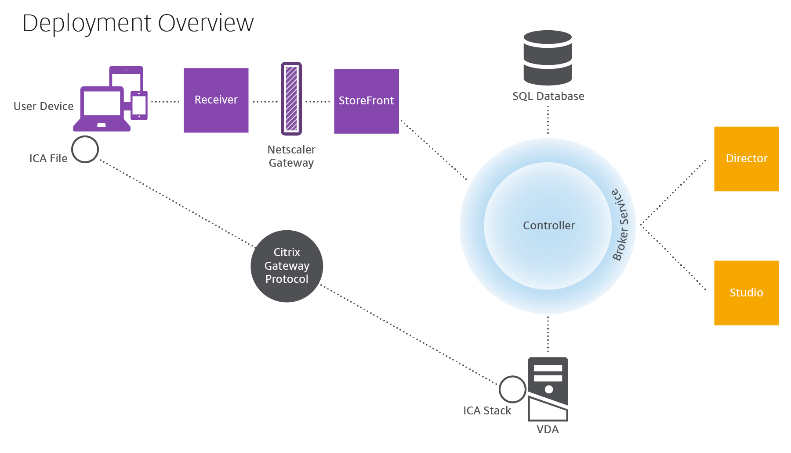
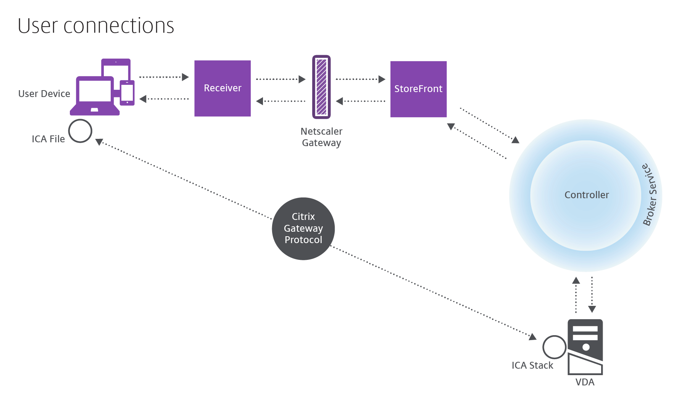

[TOC]

[官方文档](https://docs.citrix.com/en-us/citrix-virtual-apps-desktops.html)

# 技术概述

`Citrix Virtual Apps and Desktops`是虚拟化解决方案，可以为IT提供对虚拟机，应用程序，许可和安全性的控制，同时为任何设备提供任何访问权限。

- 终端用户独立于设备的操作系统和界面运行应用程序和桌面。
- 管理员可以管理网络并控制所选设备或所有设备的访问。
- 管理员可以从单个数据中心管理整个网络。

Citrix Virtual Apps and Desktops共享称为`FlexCast Management Architecture (FMA)`的统一体系结构。

## 关键组件

### Delivery Controller

`Delivery Controller`是站点的中心管理组件。

如果部署包括虚拟机管理程序或云服务，则Controller服务与其进行通信以分发应用程序和桌面，验证和管理用户访问，代理用户与其桌面和应用程序之间的连接，优化使用连接以及对这些连接进行负载平衡。

Controller管理桌面的状态，根据需求和管理配置启动和停止它们。

### Database

每个站点至少需要一个`Microsoft SQL Server`数据库来存储配置和会话信息。此数据库存储由组成Controller的服务收集和管理的数据。

该站点还使用配置日志记录数据库和监控数据库，默认情况下，这些数据库安装在与站点数据库相同的位置。

### Virtual Delivery Agent (VDA)

`VDA`安装在站点中可供用户使用的每台物理机或虚拟机上。这些机器提供应用程序或桌面。VDA使机器能够向Controller注册，从而使机器及其托管的资源可供用户使用。VDA建立和管理机器与用户设备之间的连接。

“VDA”一词通常用于表示代理以及安装它的机器。

支持Windows服务器和桌面版、Linux。

### Citrix StoreFront

`StoreFront`对用户进行身份验证，并管理用户访问的桌面和应用程序的存储。它可以托管您的企业应用程序商店，使用户可以自助访问您可以使用的桌面和应用程序。

### Citrix Workspace app

`Citrix Workspace app`安装在用户设备和其他端点（例如虚拟桌面）上，为用户提供对文档、应用程序和桌面的快速、安全、自助式服务的访问。

### Citrix Studio

`Studio`是管理控制台，可以在其中配置和管理`Citrix Virtual Apps and Desktops`部署。

Studio提供向导来指导完成环境设置，创建托管应用程序和桌面的工作负载，以及为用户分配应用程序和桌面。还可以使用Studio为站点分配和跟踪Citrix许可证。

### Citrix Director

`Director`是一个基于Web的工具，使IT支持和帮助台团队能够监控环境，在问题变得对系统至关重要之前解决问题，并为最终用户执行支持任务。

您可以使用一个Director部署来连接和监控多个`Citrix Virtual Apps or Citrix Virtual Desktops Sites`。

展示下列内容：

- 来自Controller中`Broker Service`的实时会话数据，其中包括Broker Service从VDA中的`Broker Agent`获取的数据。
- Controller中`Monitor Service`的历史站点数据。

### Citrix License Server

`License Server`管理Citrix产品许可证。

它与Controller通信以管理每个用户会话的许可，并与Studio通信分配许可证文件。

### Hypervisor or cloud service

`hypervisor or cloud service`托管站点中的虚拟机。这些可以是用于托管`应用程序和桌面`的VMs，也可以是用于托管`Citrix Virtual Apps and Desktops`组件的VMs。

*Citrix Virtual Apps and Desktops*支持多种 *hypervisors and cloud services*。

虽然许多部署需要管理程序，但您不需要提供远程PC访问。使用`Provisioning Services（PVS）`配置VM时，也不需要虚拟机监控程序。

## 附加组件

这些组件是可选的。

### Citrix Provisioning

是以前的PVS。它为`MCS`提供了供应虚拟机的替代方案。MCS创建主映像的副本，而PVS将主映像流式传输到用户设备。PVS不需要管理程序来执行此操作，因此您可以使用它来托管物理机。 PVS与Controller通信以向用户提供资源。

### Citrix Gateway

当用户从公司防火墙外部进行连接时，Citrix Virtual Apps and Desktops可以使用`Citrix Gateway`（以前称为*Access Gateway*和*NetScaler Gateway*）技术和TLS来保护这些连接。

### Citrix SD-WAN

在将虚拟桌面交付给远程位置（如分支机构）的用户的部署中，可以使用`Citrix SD-WAN`技术来优化性能。

## 典型部署的工作原理

*VDA*让用户能够连接到桌面和应用程序。它安装在数据中心的服务器或台式机上，它安装在数据中心的服务器或台式机上，适用于大多数交付方式，但也可以安装在物理PC上以进行远程PC访问。

*Controller*由独立的Windows服务组成，可管理资源，应用程序和桌面，并优化和平衡用户连接。

用户永远不会直接访问*Controller*。 *VDA*充当用户和*Controller*之间的中介。当用户使用*StoreFront*登录时，他们的凭据将传递给*Controller*上的*Broker Service*。然后，*Broker Service*根据为其设置的策略获取配置文件和可用资源。

## 如何处理用户连接

要启动会话，用户可以通过用户设备上安装的*Citrix Workspace*应用程序或*StoreFront*网站进行连接。

用户选择所需的物理或虚拟桌面或虚拟应用程序。

用户的凭据通过此路径传递以访问*Controller*。

*Broker Service*决定了用户可以访问的桌面和应用。

验证凭据之后，通过*StoreFront-Citrix Workspace*路径返回可用的应用和桌面的信息。用户从列表选择之后，*Controller*确定适当的*VDA*以托管特定应用程序或桌面。

*Controller*使用用户的凭据向*VDA*发送消息，然后将有关用户和连接的所有数据发送到*VDA*。*VDA*接受连接并通过相同的路径将信息发送回*Citrix Workspace*应用程序。在*StoreFront*上收集一组必需参数。然后，这些参数作为`Citrix-Workspace-app-StoreFront`协议会话的一部分发送到*Citrix Workspace*应用程序，或转换为`Independent Computing Architecture（ICA）`文件并下载。

*ICA*文件被复制到用户的设备，并在设备和*VDA*上运行的*ICA*堆栈之间建立直接连接。

*Citrix Workspace*应用程序与*VDA*之间的连接使用`Citrix Gateway Protocol（CGP）`。

客户端连接到*VDA*后，*VDA*会通知*Controller*用户已登录。然后，*Controller*将此信息发送到*Site*（*Site*是你为*Citrix Virtual Apps and Desktops*部署提供的名字，它包括Delivery Controller和其他核心组件）数据库，并开始在监视数据库中记录数据。

## 数据访问的工作原理

每个*Citrix Virtual Apps and Desktops*会话产生的数据，IT都能通过*Studio*或*Director*获取。使用*Studio*，管理员可以获取从*Broker Agent*到管理站点的实时数据。*Director*从监控数据库中访问实时数据和历史数据。还可以从`NetScaler Gateway`访问`HDX`数据，以获得技术支持和故障排除。

在Controller内，*Broker Service*报告机器上每个会话的会话数据，提供实时数据。 *Monitor Service*还跟踪实时数据并将其作为历史数据存储在监控数据库中。

*Director*还可以访问*Citrix Gateway*以获取有关*HDX*数据的信息。

## 提供桌面和应用程序

你可以使用**计算机目录**（Machine catalogs）设置提供应用程序和桌面的计算机。然后，创建`Delivery Groups`，指定可用的应用程序和桌面（使用目录中的计算机），以及哪些用户可以访问它们。可选的，你可以创建`Application Groups`管理一批应用。

### Machine catalogs

计算机目录是作为单个实体管理的虚拟机或物理计算机的集合。这些机器，和在机器上面的应用或虚拟桌面是你提供给用户的资源。在catalog中所有的机器都安装了**相同的操作系统和相同的VDA**。它们也具有**相同的应用程序或虚拟桌面**。

通常，您创建主镜像（image）并使用它在目录中创建相同的VM。对于VM，您可以为该目录中的计算机指定配置方法：Citrix工具（*Citrix Provisioning*或*MCS*）或其他工具。或者，您可以使用现有镜像。在这种情况下，您必须单独管理目标设备，或使用第三方`electronic software distribution（ESD）`工具共同管理目标设备。

合适的机器类型：

- **Server OS machines**：服务器操作系统的虚拟机或物理机。

    > 用于提供Citrix Virtual Apps发布的应用程序（也称为基于服务器*server-based*的托管应用程序）和Citrix Virtual Apps发布的桌面（也称为服务器托管*server-hosted*的桌面）。这些机器允许多个用户同时连接到它们。

- **Desktop OS machines**：桌面操作系统的虚拟机或物理机。

    > 用于提供VDI桌面（运行可选择个性化的桌面操作系统的桌面），VM托管的应用程序（桌面操作系统的应用程序）和托管的物理桌面。一次只能有一个用户连接到每个桌面。

- **Remote PC Access**：允许远程用户从运行*Citrix Workspace*应用程序的任何设备访问其物理办公室PC。

    > 办公室PC通过Citrix Virtual Desktops部署进行管理，并要求在白名单中指定用户设备。

### Delivery Groups

`Delivery Groups`指定了哪些用户可以访问哪些机器的哪些应用或桌面。*Delivery Groups*包含了机器目录中的机器，以及和有权访问*Site*的`Active Directory`用户。

Delivery Groups可以包括多个目录的多个机器，每个目录也可以向多个Delivery Groups贡献机器。但是单独的机器同时只能属于一个Delivery Groups。

更多请参考[Create Delivery Groups](https://docs.citrix.com/en-us/citrix-virtual-apps-desktops/install-configure/delivery-groups-create.html)。

### Application Groups

Application Groups提供方便的应用管理和资源控制。

更多请参考[Create Application Groups](https://docs.citrix.com/en-us/citrix-virtual-apps-desktops/install-configure/application-groups-create.html)。

# Active Directory

身份验证和授权需要`Active Directory`。

要使用策略建模,域控制器必须在 Windows Server 2003 到 Windows Server 2012 R2 上运行;这不会影响域功能级别。

此产品支持：

- 用户帐户和计算机帐户存在于单个 Active Directory 林的域中的部署。

    > 用户和计算机帐户可以存在于单个林中的任意域中。这种类型的部署支持所有域功能级别和林功能级别。

- 其中用户帐户存在于活动目录林中，与包含控制器和虚拟桌面的计算机帐户的 Active Directory 林不同的部署。

    > 包含 Controller and virtual desktop computer 帐户的域必须信任包含用户帐户的域。可以使用林信任或外部信任。这种类型的部署支持所有域功能级别和林功能级别。

- Active Directory 林中存在计算机帐户控制器，该林不同于包含虚拟桌面的计算机帐户的一个或多个其他 Active Directory 林的部署。

    > 包含Controller计算机帐户的域与包含虚拟桌面计算机帐户的所有域之间必须存在双向信任。包含Controller或虚拟桌面计算机帐户的所有域必须处于"Windows 2000 native"功能级别或更高。支持所有林功能级别。

- 可写域控制器。不支持只读域控制器。